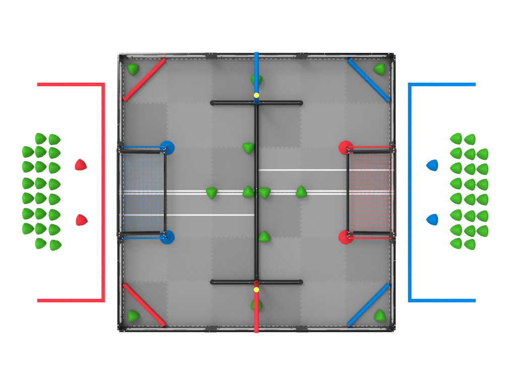
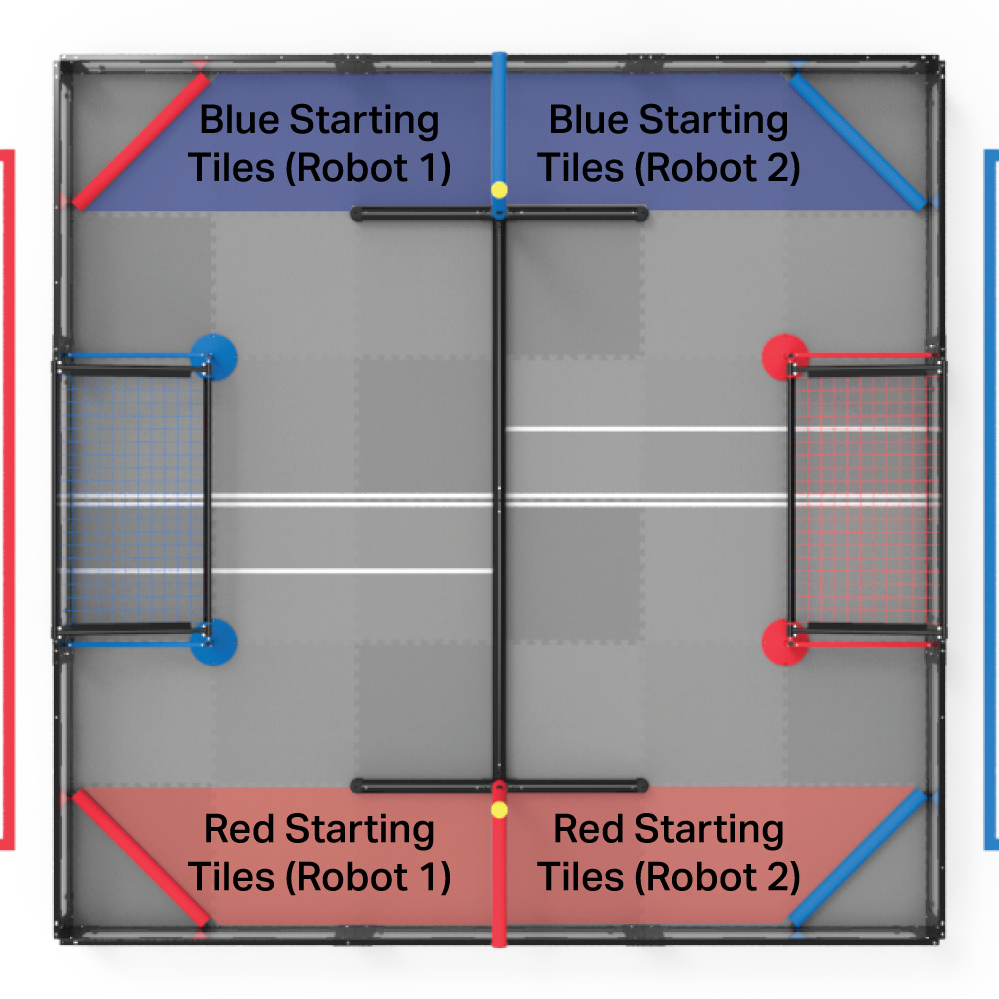
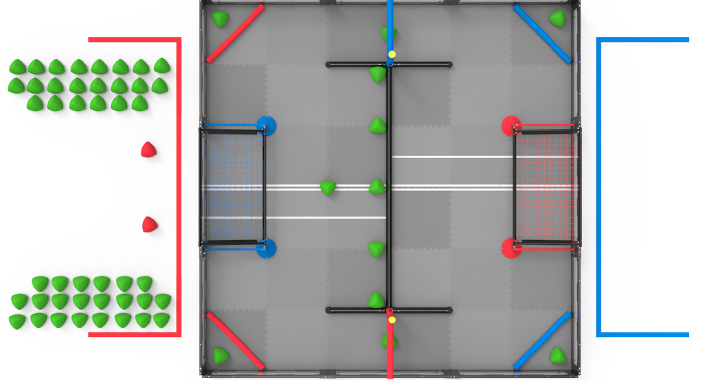
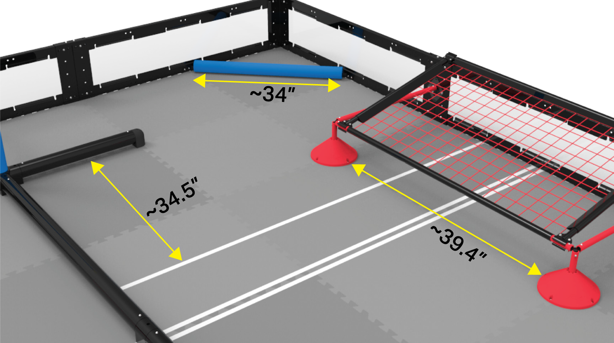
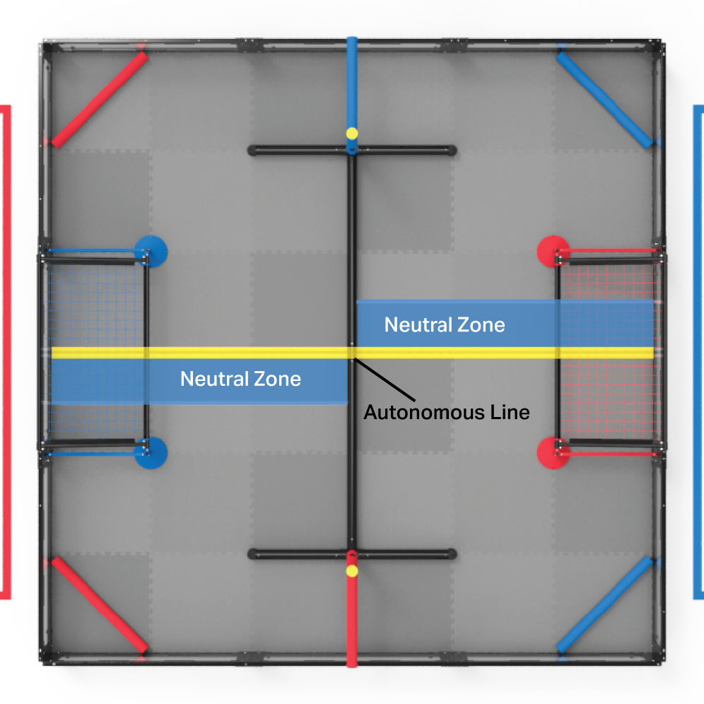
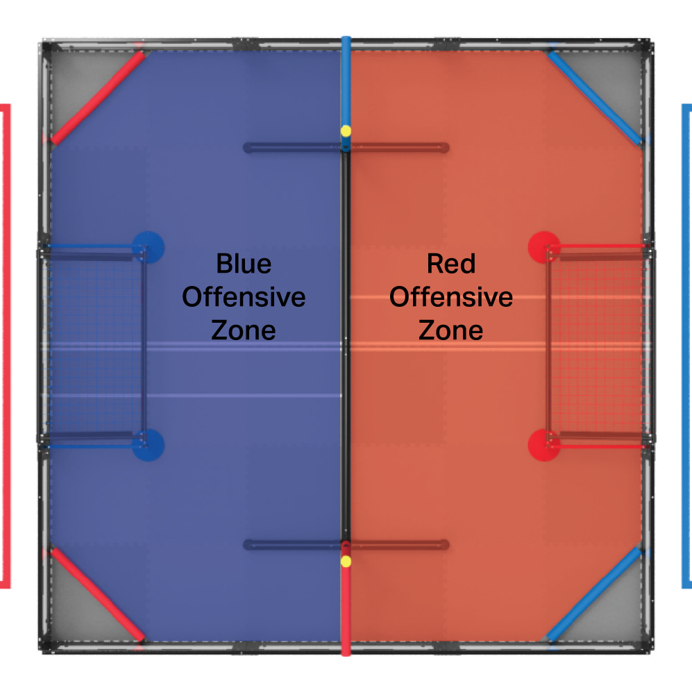
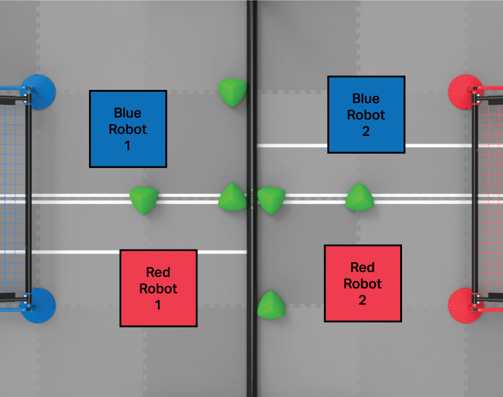
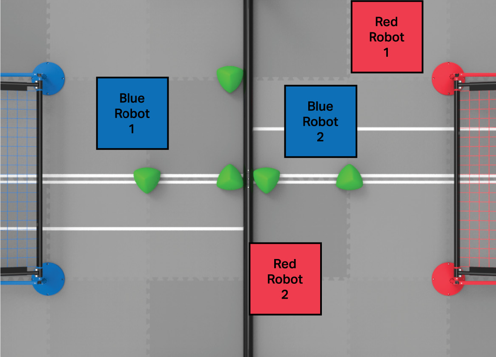
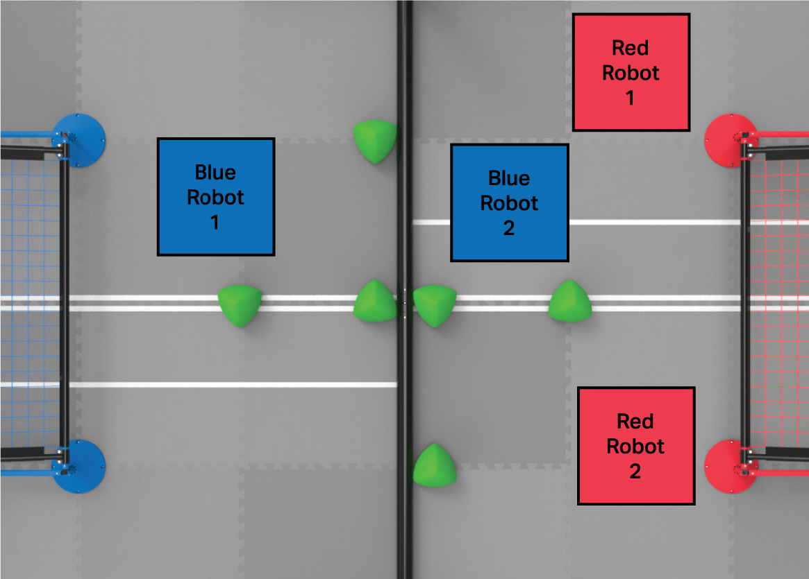
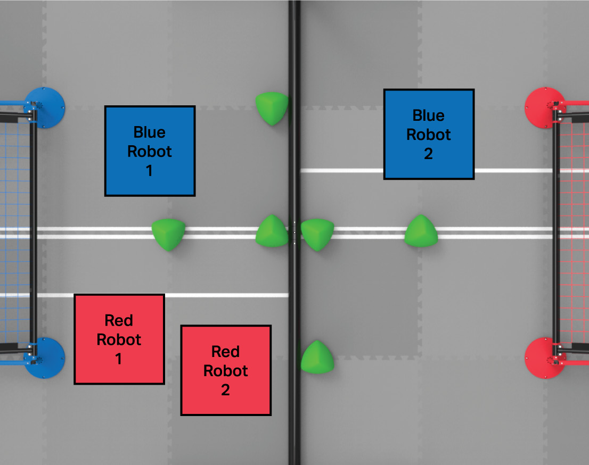

# 285C VRC Over Under (2023-2024)

Hosts 285C's code for Over Under

# Game Details

Latest version of the [Over Under Game Manual](https://link.vex.com/docs/23-24/vrc-over-under/GameManual)

If the version is higher than Version 1.1 (7/11/2023), please let me know so we can review the changes.

<details>
  <summary><h2>Commonly Referenced Images</h2></summary>

### Field, Match



<br>

### Starting Tiles



<br>

### Field, Skills



<br>

### Field Element Reference Lengths



<br>

### Neutral Zones



<br>

### Offensive Zones



<br>

### Breakdown of Double Zoning

<table>
   <tr>
      <td><h4><strong>No one is double zoning. </strong><br>One bot is on each half of the map.</h4></td>
      <td><h4><strong>No one is double zoning. </strong><br>The red bot is touching the barrier, so no double zoning is occuring.</h4></td>
   </tr>
   <tr>
      <td></td>
      <td></td>
   </tr>
   <tr>
      <td><h4><strong>Red is double zoning. </strong><br>Both red bots are in the red offensive zone.</h4></td>
      <td><h4><strong>Red is double zoning. </strong><br>Both red bots are in the blue offensive zone.</h4></td>
   </tr>
   <tr>
      <td></td>
      <td></td>
   </tr>
</table>

</details>
<details>
  <summary><h2>Game Manual Changes</h2></summary>

### Version 2.0 - August 1, 2023
 > - Updated \<G8> to clarify the legality of items brought to the field by Drive Team Members
 > - Updated \<R22a> and added a note to clarify pneumatic reservoir legality
 > - Updated \<T1e> to clarify that a Head Referee may only watch one Match at a time
 > - Updated \<T11> to address using PVC to replace a damaged section of a Goal
 > - Updated figure 41 to fix the position of misaligned Triballs
 > - Minor typo / formatting fixes

### Version 1.1 - July 11, 2023

> - Added VEX U Robot Rules

### Version 1.0 - June 27, 2023

> - Updated point 1b in the definition of Elevated to state that a Robot must be contacting any portion of the Barrier that is on their Alliance’s side of the Neutral Zone
> - Added point 4 to the definition of Elevated to state that a Robot may not be contacting an Alliance partner Robot that is not considered Elevated
> - Added a note to \<SC7> to clarify intent
> - Added a note to \<SG1> and \<RSC2e> to clarify that the Triballs beginning in Match Load Zones may be repositioned by Teams. The note in \<G9> was also updated to reflect this change
> - Revised \<SG3> to state that any Triballs that leave the field will be returned to the nearest Match Load Zone
> - Added a Violation note to \<SG9> to clarify intent
> - Added \<SG11d>, stating that Robots may not contact the Short Barriers adjacent to the opposing Alliance’s Elevation Bars during the last thirty (30) seconds of the Match
> - Updated \<T9> to provide clarity regarding when Time Outs may be used
> - Updated \<T10> to provide a Goal height tolerance, and to provide further clarity
> - Added a Violation note to \<RSC1> to clarify intent
> - Added Appendix C for VEX U
> - Minor typo / formatting fixes

### Version 0.2 - June 13, 2023

> - Updated the definition of Elevation Tier to clarify that Robots must be “fully above the white line” of the Height Guide to receive credit for that Elevation Tier
> - Added a note to \<SC3>, clarifying that a Triball Scored in a Goal is not also considered Scored in that Goal’s Offensive Zone
> - Revised the note in \<SG5> to clarify that the net cannot be lifted to score / de-score
> - Updated \<T5> to include Autonomous Win Points
> - Updated \<T8> to clarify that a Team that receives a Disqualification in a Qualification Match also receives a score of (0) for the Match
> - Added an REC Library article link to \<R7> to provide clarity
> - Updated Robot Skills Challenge Ranking 9a to Number of Triballs Scored in Goals
> - Minor typo / formatting fixes

### Version 0.1 - April 29, 2023

> - Initial Release

</details>

# Building

## 1. Compile the code

To build the code, run:

```
prosv5 make
```

> ⚠️ If you get a build error that looks like the following message:
>
> ```
> Linking hot project with ./bin/cold.package.elf and libc,libm,libpros,okapilib [ERRORS]
> %appdata%/local/programs/pros/toolchain/usr/bin/../lib/gcc/arm-none-eabi/10.2.1/../../../../arm-none-eabi/bin/ld.exe: bin/   > opcontrol.cpp.o: in function `std::__shared_ptr<okapi::ChassisModel, (__gnu_cxx::_Lock_policy)0>::~__shared_ptr()':
> %appdata%\local\programs\pros\toolchain\usr\arm-none-eabi\include\c++\10.2.1\bits/shared_ptr_base.h:1183: undefined reference   > to `drive'
>
> collect2.exe: error: ld returned 1 exit status
> make: *** [common.mk:252: bin/hot.package.elf] Error 1
> ERROR - pros.cli.build:make - Failed to make project: Exit Code 2
> Error: Failed to build
> Sentry is attempting to send 1 pending error messages
> Waiting up to 2 seconds
> Press Ctrl-Break to quit
> ```
>
> I'll need Jay to verify this, but based on my troubleshooting, it's because the undefined object in question was defined in a function, not "globally" within the file.
>
> I suspect this means that, despite declaring the object in the header file with `extern`, the object is not actually defined until the function is called, causing the compiler to freak out.
>
> To remedy this, simply move the declaration of the object to the top of the file (but below the `#ifndef`/`#define` or `#include` statements), outside of any functions. This will cause the object to be defined when the file is compiled, and the compiler will stop screaming at you.

## 2. Upload the binary

To upload the code to a brain or a controller, run:

```
prosv5 upload
```

## 3. Run the code

1. On the controller, using arrow keys to scroll, select the `Programs` tab.
2. Scroll until you select the program you just uploaded.
3. Press the `A` button to run the program.

# Contributing

Since this is hosted on GitHub, please follow the best practices for code collaboration outlined in [this document](https://cdn.discordapp.com/attachments/1062157317208035333/1062196035021181000/codeCollab.pdf).

Here's a quick summary:

## Make sure to make a branch for your work before you start.

1. Open a Command Prompt or PowerShell window to the repository directory.
2. Create a new branch.
   ```
   git checkout -b <branch-name>
   ```
3. Make and save any changes in the directory now. They will be tracked.
4. Once a file is saved or changed, add and commit your changes.
   ```
   git add .
   git commit -m "<message-text>"
   ```
5. If someone else makes changes to any branch, update and merge your local copy with the remote changes.
   ```
   git pull
   ```
6. Repeat steps 3 and 5 until your code is complete.

## When you are done, upload your code and make a pull request back to the main branch.

1. Open a Command Prompt or PowerShell window to the repository directory.
2. "Register" your new branch with GitHub and push any changes to it.
   ```
   git push -u origin <branch-name>:<branch-name>
   ```
   > You must run the above command first before you can run the truncated command for subsequent pushes. Here's what it looks like:
   >
   > ```
   > git push
   > ```
3. On GitHub, open your branch.
4. Create a pull request by clicking the link in `x commits ahead of master`.
5. Review that the information is correct and that the arrow is pointing from your branch to the master branch.
   > This would be correct:
   >
   > ```
   > base: master <- compare: <branch-name>
   > ```
6. Create the pull request, but **do not merge to master**.
